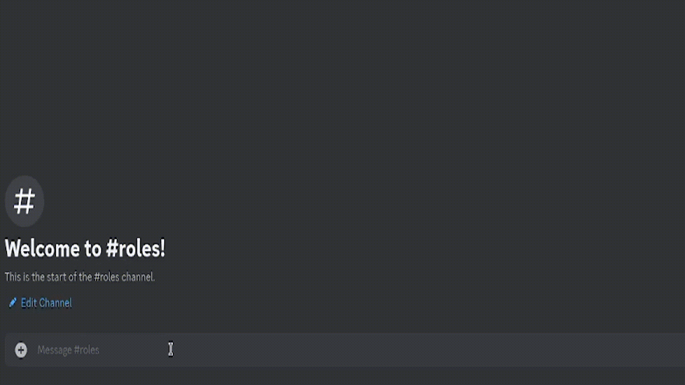
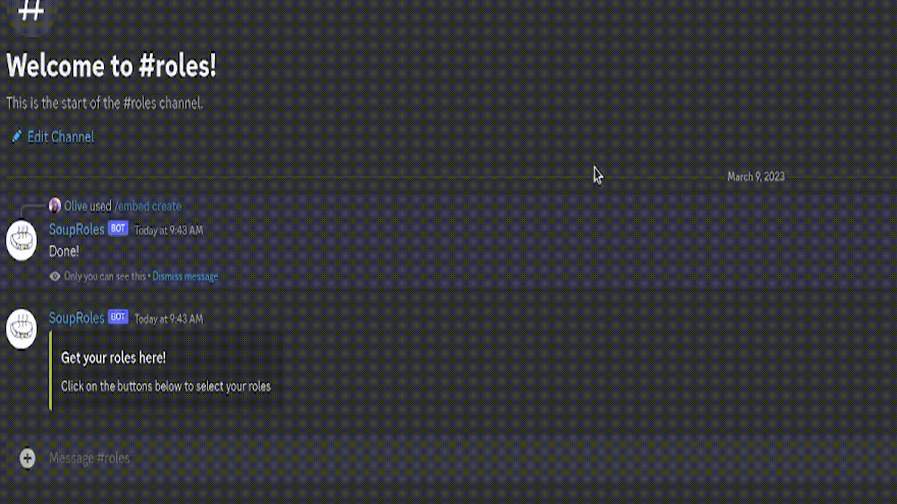
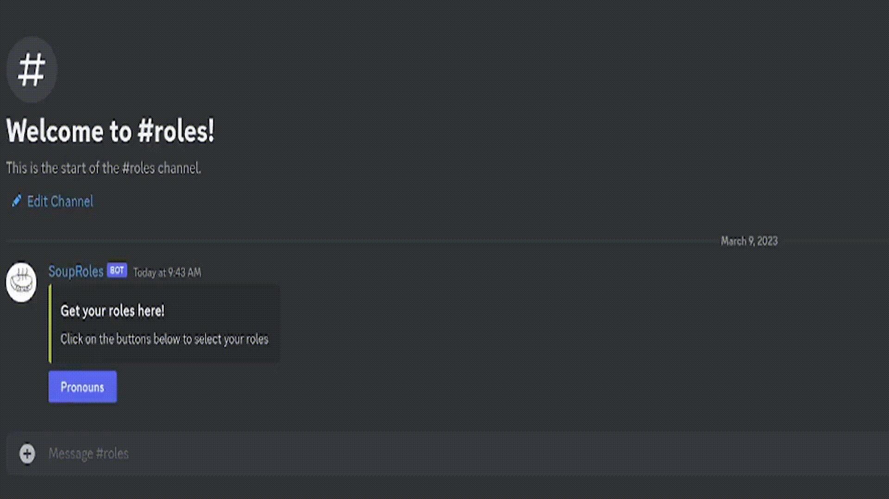

# Getting Started

[Click here](https://discord.com/api/oauth2/authorize?client_id=1069718385258156096&permissions=268437504&scope=bot%20applications.commands) to add the bot to your server. It requires the `Manage Roles` and `Send Messages` permissions. Make sure the bot's highest role is above any roles you want it to be able to assign in the role hierarchy. The bot will also need permission to send messages in any channel you want to create an embed in.

Start by making an embed, using the [/embed create](#embed-create) command

Then create a button on that embed using [/button create](#button-create)

Finally, add some roles to that button using [/role assign add](#role-assign-add)

Optionally, add an embed to the button as well using [/role embed set](#role-embed-set) to give your users more information about the role dropdown

A single message can have multiple buttons, up to 25. This is a limitation of Discord itself. Each button can be used for its own role menu (with up to 25 role options), allowing for up to 25 different role menus on a single message.

You'll need Discord developer mode enabled to get the message ID to use the bot. In the Discord client, go to Settings -> Advanced -> Developer Mode to enable it

# Command Usage

## Embed Command

Command used to create and update embed messages with the bot

### /embed create

Used to create a new embed message

Note: Command fields do not support newlines. Use `\n` to create a newline in your embed

Options

- content
  - The main body of the embed
  - Requried
- title
  - The title of the embed
  - Not required, defaults to no title
- color
  - The hexadecimal or RGB color code for the bar on the left of the embed
  - Not required, defaults to dark grey

Examples:

- `/embed create content:Select your roles here! title:Role Selector color:42be9a`
- `/embed create content:Select some roles`

### /embed update

Used to update an existing embed message

Options

- message
  - The message ID of the embed to update, must be one created with this bot
  - Required
- content
  - The new main body of the embed
  - Requried
- title
  - The new title of the embed
  - Not required, defaults to no title
- color
  - The new hexadecimal or RGB color code for the bar on the left of the embed
  - Not required, defaults to dark grey

Examples:

- `/embed update message:1069342907129139291 content:New text title:New title`
- `/embed update message:1069342907129139291 content:Other text in this embed color:231,90,63`

## Button Command

Command for managing buttons on an embed message

### /button create

Used to create a new button on a message

Options

- message
  - The message ID of the message to place a button on, must be one created with this bot
  - Required
- id
  - The custom ID of the button you are creating
  - Required
- title
  - The text that will be displayed in the button
  - Required

Examples:

- `/button create message:1069342907129139291 id:pronounButton title:Pronouns`
- `/button create message:1069342907129139291 id:this can have spaces title:Button Text`

### /button delete

Used to delete a button on a message

Options

- message
  - The message ID of the message to delete the button from
  - Required
- id
  - The custom ID of the button you are deleting
  - Required

Example:

- `/button delete message:1069342907129139291 id:pronounButton`

### /button update

Used to update the text on a button

Options

- message
  - The message ID of the message the button is on
  - Required
- id
  - The custom ID of the button you are editing
  - Required
- newtitle
  - The updated text that will be displayed in the button
  - Required

Example:

- `/button update message:1069342907129139291 id:pronounButton newtitle:Pick Pronouns`

### /button get

Used to get a list of buttons on a message. Useful for finding button IDs

Options

- message
  - The message ID of the message to get buttons for
  - Required

Example:

- `/button get message:1069342907129139291`

## Role command

### /role embed set

Set an embed for a button. Creates a new one if it doesn't exist, or replaces an existing one

Note: Command fields do not support newlines. Use `\n` to create a newline in your embed

Options

- message
  - The message ID of the message to set an embed on
  - Required
- button
  - The ID of the button to create an set on (use `/button get` to get the list of button IDs on a message)
  - Required
- content
  - The main body of the embed
  - Requried
- title
  - The title of the embed
  - Not required, defaults to no title
- color
  - The hexadecimal or RGB color code for the bar on the left of the embed
  - Not required, defaults to dark grey

Example:

- `/role embed set message:1069342907129139291 button:pronounButton content:Select your pronouns with this menu title:Pronoun Selector color:42be9a`

### /role embed delete

Delete an embed for a button

Options

- message
  - The message ID of the message to delete an embed on
  - Required
- button
  - The ID of the button to delete an embed on (use `/button get` to get the list of button IDs on a message)
  - Required

Example:

- `/role embed delete message:1069342907129139291 button:customButton`

### /role assign add

Creates a new role assignment for a button

Options

- message
  - The message ID of the message holding the button
  - Required
- button
  - The ID of the button to assign a new role to (use `/button get` to get the list of button IDs on a message)
  - Required
- role
  - The role to assign
  - Required

Example:

- `/role assign add message:1069342907129139291 button:pronounButton role:@She/Her`

### /role assign remove

Removes an existing role assignment for a button

Options

- message
  - The message ID of the message holding the button
  - Required
- button
  - The ID of the button to remove a role on (use `/button get` to get the list of button IDs on a message)
  - Required
- role
  - The role to remove
  - Required

Example:

- `/role assign remove message:1069342907129139291 button:pronounButton role:@They/Them`

### /role get

Gets currently set information for the button (assigned embed and roles)

Options

- message
  - The message ID of the message holding the button
  - Required
- button
  - The ID of the button to remove a role on (use `/button get` to get the list of button IDs on a message)
  - Required

Example:

- `/role get message:1069342907129139291 button:pronounButton`
